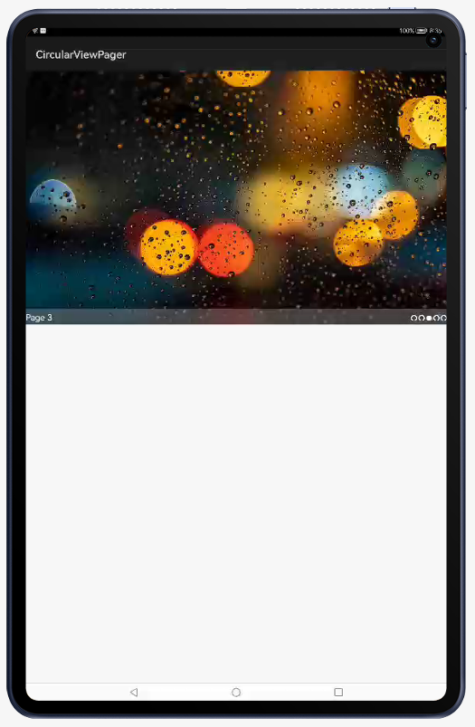

# CircularViewPager

A Circular ViewPager for HarmonyOS.

CircularViewPager actively supports ohos versions 5 and above. That said, it works all the way down to 5 but is not actively tested or working perfectly.

- [x] Supports compileSdkVersion 5
- [x] Supports Gradle 6.3

## Screenshots

Here are the screenshots showing the functionality you get with this library:

<p align="center">



</p>

## Source

Inspired from android library <https://github.com/sanyuzhang/CircularViewPager/>.

## Add Gradle dependency

1. For using CircularViewPager module in sample app, include the source code and add the below dependencies in entry/build.gradle to generate hap/CircularViewPager.har.

```
   dependencies {
       implementation project(':CircularViewPager')
   }
```

2. For using CircularViewPager in separate application using har file, add the har file in the entry/libs folder and add the dependencies in entry/build.gradle file.

```
   dependencies {
      implementation fileTree(dir: 'libs', include: ['*.har'])     
   }
```

# Usage Instructions

Add the `com.sanyuzhang.circular.viewpager.cvp.view.CircularViewPager to your layout XML file with the following values.

```
<com.sanyuzhang.circular.viewpager.cvp.view.CircularViewPager
        ohos:id="$+id:scroll_pager"
        ohos:height="480vp"
        ohos:width="match_parent"/>

<com.sanyuzhang.circular.viewpager.sample.slice.ViewPagerIndicator
            ohos:id="$+id:indicator"
            ohos:height="match_content"
            ohos:width="match_content"
            ohos:align_parent_right="true"
            ohos:padding="5vp"
            ohos:vertical_center="true"/>
```

Initialize CircularViewPager to set properties.

```
CircularViewPager pager = (CircularViewPager) component.findComponentById(ResourceTable.Id_scroll_pager);
final Text title = (Text) component.findComponentById(ResourceTable.Id_title);

ViewPagerIndicator indicator = (ViewPagerIndicator) component.findComponentById(ResourceTable.Id_indicator);

pager.addPageChangedListener(new PageSlider.PageChangedListener() {
    @Override
    public void onPageSliding(int i, float v, int i1) {

    }

    @Override
    public void onPageSlideStateChanged(int i) {

    }

    @Override
    public void onPageChosen(int i) {
        title.setText(titles[i]);
    }
});

pager.setProvider(new PageSliderProvider() {
    @Override
    public int getCount() {
        return imgs.length;
    }

    @Override
    public Object createPageInContainer(ComponentContainer componentContainer, int position) {
        Image view = new Image(componentContainer.getContext());
        ComponentContainer.LayoutConfig config = new ComponentContainer.LayoutConfig();
        config.width = ComponentContainer.LayoutConfig.MATCH_PARENT;
        config.height = ComponentContainer.LayoutConfig.MATCH_PARENT;
        view.setLayoutConfig(config);
        view.setScaleMode(Image.ScaleMode.CLIP_CENTER);
        view.setPixelMap(imgs[position]);
        componentContainer.addComponent(view);
        return view;
    }

    @Override
    public void destroyPageFromContainer(ComponentContainer componentContainer, int i, Object o) {
        componentContainer.removeComponent((Component) o);
    }

    @Override
    public boolean isPageMatchToObject(Component component, Object o) {
        return component == o;
    }
});
pager.setScrollFactor(7);
pager.setPageCacheSize(6);
pager.setOnPageClickListener(new CircularViewPager.OnPageClickListener() {

    @Override
    public void onPageClick(CircularViewPager autoScrollPager, int position) {
        if (toast != null) {
            toast.cancel();
            toast = null;
        }
        toast = new ToastDialog(context);
        toastView = (DependentLayout) LayoutScatter.getInstance(getFractionAbility()).parse(ResourceTable.Layout_fraction_toast, null, false);
        toastText = (Text) toastView.findComponentById(ResourceTable.Id_text);
        toastText.setText("Clicked page: " + (position + 1));
        toast.setComponent(toastView);
        toast.setSize(DirectionalLayout.LayoutConfig.MATCH_CONTENT, DirectionalLayout.LayoutConfig.MATCH_CONTENT);
        toast.setTransparent(true);
        toast.setOffset(0, 100);
        toast.show();
    }
});
indicator.setOnIndicatorClickListener(new ViewPagerIndicator.OnIndicatorClickListener() {
    @Override
    public void onClick(int pos) {
        pager.setCurrentPage(pos);
    }
});
indicator.setViewPager(pager);
```